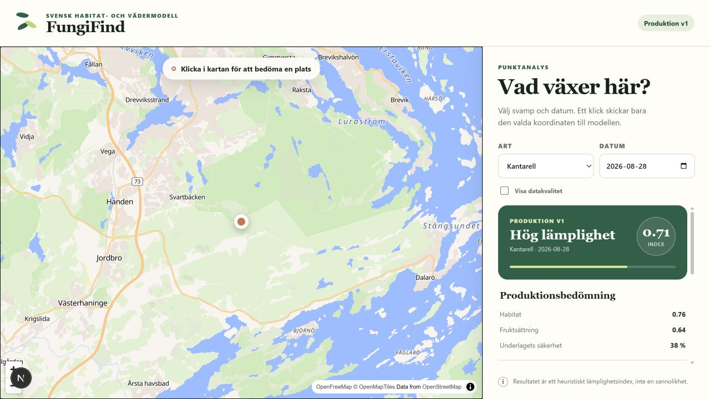

# Kartapp: punktanalys och viewportlager

Webbappen håller två flöden isär. Ett kartklick motsvarar ett API-anrop för en
enda WGS84-koordinat och ger full punktförklaring. Det valfria områdeslagret
hämtar en begränsad, batchutvärderad GeoJSON-grid för aktuell viewport och visar
endast `production_v1`.

## 1. Installera och starta backend

Från repositoryts rot:

```powershell
python -m pip install -e ".[geo,api,dev]"
python -m uvicorn fungifind.api.app:app --reload --host 127.0.0.1 --port 8000
```

Standardkonfigurationen läser habitatdata under `src/data` och MESAN-historik
från `src/data/weather/mesan_history.sqlite`. Dessa miljövariabler kan ändra
konfigurationen:

| Variabel | Standard | Betydelse |
| --- | --- | --- |
| `FUNGIFIND_DATA_ROOT` | `<repo>/src/data` | Rot för lokala modellkällor |
| `FUNGIFIND_MESAN_DATABASE` | `<data-root>/weather/mesan_history.sqlite` | SQLite med MESAN-historik |
| `FUNGIFIND_CORS_ORIGINS` | `http://localhost:3000` | Kommaseparerade tillåtna webbursprung |

Hälsokontroll:

```powershell
Invoke-RestMethod http://localhost:8000/api/health
```

Exempel på ett punktanrop:

```powershell
Invoke-RestMethod "http://localhost:8000/api/score?latitude=59.160136&longitude=18.247348&species=cantharellus_cibarius&date=2026-08-27"
```

`date` är valfritt. Om det utelämnas använder backend aktuell dag i UTC; inget
datum är hårdkodat. För en poäng måste den lokala MESAN-databasen ha fullgod
historik för de föregående 30 dygnen.

## 2. Starta frontend

I en andra PowerShell-terminal:

```powershell
cd frontend
Copy-Item .env.example .env.local
npm ci
npm run dev
```

Öppna `http://localhost:3000`. Datumfältet börjar på webbläsarens aktuella lokala
kalenderdag. Ett nytt kartklick, artbyte, datumbyte eller ändring av debugläget
avbryter eventuellt gammalt anrop och gör en ny punktförfrågan.



Desktopvyn låter kartan uppta vänstersidan och håller art, datum och resultat i en
egen rullningsbar sidopanel. Mobilvyn staplar kartan ovanför panelen.

Frontendens publika konfiguration:

| Variabel | Standard | Betydelse |
| --- | --- | --- |
| `NEXT_PUBLIC_FUNGIFIND_API_URL` | `http://localhost:8000` | FastAPI-basadress |
| `NEXT_PUBLIC_BASEMAP_STYLE_URL` | OpenFreeMap Liberty | MapLibre style-URL |
| `NEXT_PUBLIC_MAP_CENTER_LATITUDE` | `59.160136` | Startvyns latitud |
| `NEXT_PUBLIC_MAP_CENTER_LONGITUDE` | `18.247348` | Startvyns longitud |
| `NEXT_PUBLIC_MAP_ZOOM` | `10.5` | Startvyns zoom |
| `NEXT_PUBLIC_VIEWPORT_MIN_ZOOM` | `11` | Lägsta zoom som tillåter områdesanrop |
| `NEXT_PUBLIC_VIEWPORT_DEBOUNCE_MS` | `320` | Väntan efter pan/zoom |
| `NEXT_PUBLIC_VIEWPORT_PREFETCH_FRACTION` | `0.25` | Bbox-buffert per sida |
| `NEXT_PUBLIC_VIEWPORT_CACHE_ENTRIES` | `12` | Max poster i klient-LRU |

`NEXT_PUBLIC_*`-värden byggs in av Next.js. Starta om devservern efter en
ändring, och bygg om för en produktionskörning.

## API-kontrakt

`GET /api/score` kräver `latitude`, `longitude` och `species`. Arter:

- `cantharellus_cibarius`
- `craterellus_tubaeformis`

Svaret håller avsiktligt isär:

- `production`: befintliga habitat-, fruktsättnings- och slutindex med
  `model_version = "production_v1"`,
- `experimental`: v2, alltid märkt `experimental_not_production`,
- `moisture`: separat heuristiskt aktuellt markfuktighetsindex 0–1,
- `factors`: kompakt underlag för sidopanelen,
- `debug`: `null` normalt, eller sanerad provenance med `include_debug=true`.

En exkluderad punkt, exempelvis öppet vatten, ger HTTP 200 med
`eligibility.status = "excluded"` och `null` för produktionspoängen. Det är ett
giltigt modellbeslut, inte ett serverfel.

Validerings- och datakällfel använder formatet:

```json
{
  "error": {
    "code": "weather_history_incomplete",
    "message": "The selected date does not have complete 30-day MESAN history.",
    "details": []
  }
}
```

Kända felkoder omfattar `invalid_coordinates`, `invalid_species`, `invalid_date`,
`point_outside_data_coverage`, `source_data_unavailable`,
`weather_history_unavailable`, `weather_history_incomplete` och
`data_source_failure`. Klientsvaren innehåller inte lokala filsökvägar eller
stacktraces.

`GET /api/viewport` och områdeslagrets alignment, storleksgränser, GeoJSON,
cache, abortbeteende och benchmark dokumenteras i
[viewport_overlay.md](viewport_overlay.md).

## Baskarta och attribution

Standardstilen är OpenFreeMap Liberty via MapLibre GL JS. OpenFreeMap anger att
den publika instansen får användas utan API-nyckel och kräver attribution; stilen
innehåller attribution som MapLibre visar automatiskt. Tjänsten saknar SLA, så
style-URL:n ligger i miljökonfigurationen och kan bytas utan kodändring.

- OpenFreeMap: <https://openfreemap.org/>
- Integrationsguide: <https://openfreemap.org/quick_start/>
- Villkor: <https://openfreemap.org/tos/>
- MapLibre attribution: <https://maplibre.org/maplibre-gl-js/docs/API/classes/AttributionControl/>

## Test och build

Backend från repositoryts rot:

```powershell
python -m pytest
python -m ruff check .
```

Frontend från `frontend`:

```powershell
npm test
npm run lint
npm run build
```
